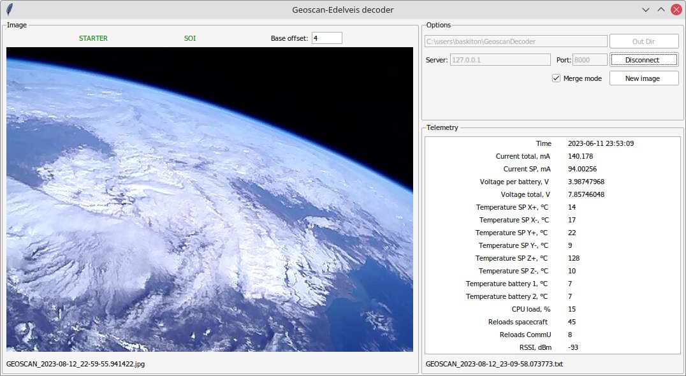

# Geoscan-Edelveis decoder

Image and Telemetry decoder for Geoscan-Edelveis satellite

First, download, setup and run geoscan soundmodem  
https://r4uab.ru/program/modem/geoscan.zip  
https://r4uab.ru/settings-soundmodem/  

To start decoding, run GeoscanDecoder and press "Connect" button. Play FM demodulated signal
and wait for result.

#### Options
* `Out Dir` Directory to store result images and telemetry
* `Server` Hostname or IP-address of soundmodem
* `Port` Port of soundmodem (see in File -> Devices -> AGWPE Server Port)
* `Merge mode` When enabled, all new images data will store to one file
* `New Image` Force a new image


#### Hotkeys
* `Ctrl-Q` Quit
* `F1` Show About window, check if newer version available




### Run from source
Required at least Python 3.7  
I recommend to use a virtual environment

Install required packages:
```commandline
pip install -r requirements.txt
```

To run:
```commandline
python -m GeoscanDecoder --ui
```


### Build from source
Required at least Python 3.7  
I recommend to use a virtual environment

```commandline
pip install -r requirements.txt
pip install pyinstaller
pyinstaller -y decoder.spec
```
The result build can be found in the `dist` folder
